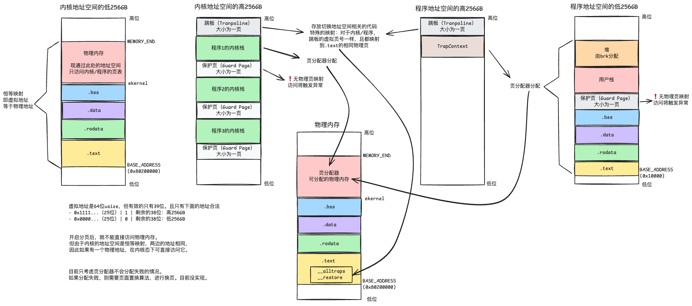

这是参考清华大学的[rCore-Tutorial-Book](https://rcore-os.cn/rCore-Tutorial-Book-v3/index.html)课程实现的内核。有详尽的注释和README，方便理解和回顾。可将本项目当作学习笔记使用。

## 运行

在根目录下，执行

- `make docker`：进入Docker环境。该环境安装了qemu、rust、cargo等工具。
- `make run`：进入Docker环境，并启动Qemu模拟器，运行内核。

在Docker环境中，切换到`os`目录下，可执行命令：

- `make run`：运行内核。
- `make dbgserver`：运行内核，并启动GDB调试服务器（监听端口`1234`）。
- `make dbgclient`：连接GDB调试服务器，连接到内核进程。

## 实现的功能

本项目会编译到目标平台`riscv64gc-unknown-none-elf`。`unknown`表示该目标平台不使用操作系统，`elf`表示编译出来的文件是ELF格式。

### 1. 基本的执行环境

使用Qemu模拟RISC-V计算机。计算机启动时，控制权的变化为：

1. 硬件：由硬件固化的汇编程序负责，执行初始化后，将控制权交给`0x80000000`地址上的程序；
2. bootloader：引导程序。该程序需要被加载到`0x80000000`，做相关的初始化工作后，并将控制权交给`0x80200000`地址上的程序。我们用的RustSBI就属于这个角色。
3. 内核：最终接管计算机的控制权。内核必须被加载进`0x80200000`地址处。

还需要定义内核的内存布局：

- 入口函数是`_start`，由汇编代码（[`entry.asm`](./os/src/entry.asm)）编写。它会进入Rust方法`rust_main`，打印`Hello, world!`。
- 链接脚本（[`linker.ld`](./os/src/linker.ld)）定义内存布局。需要注意的是，启动时要将`.bss`段清零。
- 要让`0x80200000`处的第一条指令，是入口函数`_start`，才能保证控制权的交接。
  - 直接使用`cargo build --release`编译出来的ELF文件是不行的，因为它还携带头信息和符号表。
  - 需要用`rust-objcopy`工具裁剪（strip）它们，才能使第一条指令在内核内存段的初始位置。

此外，内核处于Supervisor特权级别，而RustSBI处于更高的Machine特权级别。内核需要借助RustSBI提供的SBI接口，才能操作硬件。这里使用了库`sbi-rt`提供的SBI接口封装。

### 2. 批处理程序

在早期的计算机系统中，用户每次只能加载一个程序到内存中。等上一个执行完后，才能加载下一个。而批处理操作系统，允许用户一次性加载多个程序到内存，让操作系统依次执行它们。

批处理系统如何批量加载程序，并依次运行？本项目的实现：

1. 在内核启动时，先将所有程序的二进制，都加载进内核的`.data`区。同时记录各个程序的内存起始和结束位置。
2. 内核要选择程序执行时：
   1. 先在`.data`区找到程序的二进制代码
   2. 将它们复制到内核的`.text`区（具体是`0x80400000`处，这是系统约定的程序起始位置）

用户程序位于User特权级别，而内核位于Supervisor特权级别。程序调用系统调用时，会触发Trap，从User模式（用户态）进入Supervisor模式（内核态）。这样才能执行Supervisor级别的指令。

硬件层面，有一些跟处理Trap相关的控制寄存器CSR（Control and Status Register）：

| CSR       | 功能                                                |
| --------- | --------------------------------------------------- |
| `sstatus` | 记录 Trap 发生之前，CPU 处在哪个特权级（S/U）等信息 |
| `spec`    | 记录 Trap 发生之前，执行的最后一条指令的地址        |
| `scause`  | 描述 Trap 的原因                                    |
| `stval`   | 给出 Trap 附加信息                                  |
| `stvec`   | 控制 Trap 处理代码的入口地址                        |

可以编写自己的处理Trap的入口方法，并将它的地址设给CSR寄存器`stvec`。遇到Trap后，CPU就会自动跳转到该地址，进入该方法。

程序进行一次系统调用的流程如下：

1. 程序调用`ecall`指令，在寄存器`a0`/`a2`/`a3`（`x10`/`x11`/`x12`）中传递参数。该指令将触发Trap。
2. CPU切换到S模式，进入处理Trap的入口方法`__alltraps`。它将保存程序的上下文（即当前寄存器的值）到内核栈上。
3. `__alltraps`方法最后调用Rust的`trap_handler`方法，根据Trap的类型，执行不同的逻辑。
4. 调用汇编方法`__restore`（但不是必要的，由trap分支决定）。该方法主要做：
   - 内核栈上保存着程序的上下文，将它们恢复到寄存器上；
   - 执行`sret`指令。该指令会切换回U模式，并将`spec`寄存器的值写入到`pc`寄存器（指向要执行的下一条指令），从而将控制权交还给程序。

要保存/恢复的上下文（用类型`TrapContext`表示），包括这些寄存器：

- 通用寄存器`x0`~`x31`
- CSR寄存器`sstatus`
- CSR寄存器`sepc`

### 3. 多道程序与分时系统

本节要实现：

- 多道程序：批处理系统，只允许将一个程序放进内存（确切地说，是`.text`段）。而多道批处理程序，能把多个程序一起放入内存。
- 分时系统：先前的系统里，只有上一个程序运行完，才能运行下一个。而分时系统，能让多个程序同时运行。每个程序运行一小段时间，然后切换到下一个程序。根据让出的方式，可以分为协作式（程序主动让出）和抢占式（操作系统强制切换）。

多道系统的实现思路

1. 多个程序要同时加载到内存中，因此它们的`.text`段不能重叠，否则指令位置就重叠了。
   - 这里用的是静态加载，因此程序编译时，要知道这个位置。
   - 我们要修改程序（`user`目录）的链接脚本（`build.py`），让它们处于不同的`.text`段。
2. 启动内核后，把这些程序的二进制加载进`.data`段（`build.rs`生成`link_app.S`定义）。
3. 运行任务时，要将这些二进制从`.data`段复制到1规定的`.text`段（`loader.rs`），然后切换到其入口地址。

分时系统的核心则是任务切换。该流程如下：

1. 内核启动后，先将多个程序
   1. 加载到不重叠的`.text`段；
   2. 每个程序都有独有的内核栈`KERNEL_STACK[i]`，用来保存自己的上下文。它们彼此不能重叠。可将这个区域理解成，内核栈中分配给该程序的一块区域。
2. 程序1开始执行。
3. 程序1执行系统调用`sys_yield`。从用户态切换到内核态的过程中，会做（`__alltraps`）：
   1. 通过寄存器`sscratch`，获取程序1上下文要保存在哪个栈上。这个值是`KERNEL_STACK[1]`，由`__restore`方法设置的（因此首次运行程序，是先执行`__retore`）。
   2. 将程序1的上下文，保存到该栈上。
   3. 保存后，栈指针`sp`会指向`KERNEL_STACK[1] - bytes_len(KERNEL_STACK[1])`（栈从高位往低位增长）。后续系统调用的逻辑，能用这个栈存局部变量等。
4. 进入`sys_yield`的核心逻辑`__switch`：将控制权交给程序2。这里会做：
   1. 让`sp`指向`KERNEL_STACK[2] - bytes_len(KERNEL_STACK[2])`，该值是提前计算出来的。这叫**换栈**，即让`sp`从原来的栈，指向另一个栈。
   2. 修改`ra`为`__restore`的地址；
   3. 执行`ret`指令。这会将`ra`的值写入`pc`寄存器，从而跳转到`__restore`方法。
5. 进入`__restore`，从内核态回到用户态。这里会做：
   1. 将`sp`指向的栈（`KERNEL_STACK[2] - bytes_len(KERNEL_STACK[2])`）所保存的上下文，恢复到寄存器上；
      - 这些寄存器包括：`spec`（回到用户态后要执行的下一条指令）、`sp`（指向回用户栈）
      - 如果程序2是初次运行，则`spec`会指向base address。也就是程序2的`.text`区的初始位置。
   2. `sscratch`会指向`KERNEL_STACK[2]`。这是为了下一次回到第3步，才能知道要把程序2的上下文保存在哪里。。
   3. 最后执行`sret`。该指令将`spec`的值赋给`pc`寄存器，从而进入程序2的控制流。

以上是协作式调度方式。基于此，可以实现抢占式调度。这要借助硬件支持：

- 寄存器`mtime`是计时器，存放了CPU上电以来，经过的时钟周期数。
- 寄存器`mtimecmp`则是比较器。当`mtime`的值大于`mtimecmp`的值时，会触发时钟中断。

这样思路就很简单了——实现一个时钟中断处理逻辑：

1. 进入内核时，先手动设置`mtimecmp`，触发时钟中断；
2. 时钟中断的处理逻辑：
   - 调用`__switch`方法，切换到下一个程序；
   - 更新`mtimecmp`的值，触发下一个时钟中断（这里按10ms的间隔）。

### 4. 地址空间

RSIC-V中，虚拟地址的有效位有`39`位

```
虚拟地址 = 在一级页表的偏移（9位）| 在二级页表的偏移（9位）｜在三级页表的偏移（9位）| 页内偏移（12位）
```

引入地址空间后，访问数据就只能使用虚拟地址了。虚拟地址会映射到物理地址（`44`位）上：

- 虚拟地址组成的集合，称为地址空间。内核和程序都有独立的地址空间，彼此不干扰。
- 内存的访问单元为页。每次都是读取整页，再通过偏移找到地址。
- 页的大小一般为4KB。

页表由页表项组成。每个页表项都记录某个虚拟页到物理页的映射。每个页表为4KB（一张页），有512个页表项（每个为8B）。

```
页表项 = 保留位（10位）｜映射的物理页号（44位）｜保留位（2位）｜标志位（8位）
```

硬件`MMU`可自动将虚拟地址转换成物理地址。该过程中，需要告诉`MMU`要访问的虚拟地址，以及根页表的**物理**地址。

- 根页表的物理地址，记录在CSR寄存器`satp`中。因此每次切换地址空间（切换到不同程序、切入内核态等）时，都要修改该寄存器。
- `MMU`通过页表做地址转换：先找到根页表（一级页表），通过偏移找到二级页表的地址；按同样的方式往下找，直到找到三级页表里记录的物理页地址；最后加上页内偏移，就能得到要访问的物理地址。
- 上述过程要访问内存4次（3次访问页表，1次访问物理地址）。硬件`TLB`可以做缓存，减少这一开销。
- 页表的维护（比如页表项的增加删除等）由**操作系统负责**。页表存放在内核栈中，程序无法访问。
- 内核/程序均有独立的页表。

内存分布



什么时候切换地址空间？——切换地址空间，就是修改寄存器`satp`的值。发生的时机有：

- 启动时，切换到内核的地址空间
- 发生Trap时，从程序的地址空间，切换到内核的地址空间（`__alltraps`方法）
- 退出Trap时，从内核的地址空间，切换到程序的地址空间（`__restore`方法）

### 5. 进程

本章将引入进程：支持进程的创建、切换、调度、回收等。同时会提供SHELL，可交互式地执行程序。

进程相关的重要系统调用有：

- `fork`：创建出与父进程一样的子进程。但这些地方不同：PID、根页表的物理地址（地址空间）和`fork`方法的返回值（父进程返回子进程的PID，而子进程返回0）。
- `exec`：将某个程序加载到本进程中。它会分配新的地址空间，放入该程序的ELF二进制，并将当前进程的地址空间替换为该新的地址空间，但PID保持不变。
- `waitpid`：寻找当前进程的僵尸子进程，进行资源回收。

可以结合`fork`和`exec`，开启子进程来执行新的程序：

1. 使用`fork`开启子进程
2. 用`exec`加载程序到该子进程上

链接的符号表里，会记录程序的名字。这些名字在内核初始化时加载进入。拿到程序的名字后，就可以在符号表里找到对应的ELF二进制存放的位置。这样，传入程序的名字给系统调用`exec`，它就能找到这些数据并加载。

进程的创建和执行

- `initproc`：内核手动初始化的进程，是第一个被加载的进程。它的工作：
	- 创建SHELL子进程。这通过系统调用`fork`和`exec`实现。
	- 以轮询方式，不断找僵尸进程，并回收它的所有资源。这通过系统调用`waitpid`实现。
- `user_shell`：接收用户从STDIN输入的字符串
	- 敲击回车键时，将创建子进程；并将寻找名字为当前字符串的程序，加载到该子进程中。这通过系统调用`fork`和`exec`实现。
- 其他进程：创建后，就以时钟中断的方式得到分时执行。


### 6. 文件系统

存储设备读写的最小单位叫**物理块**（Physical Block）。不同的存储设备，物理块的大小不同。甚至叫法可能也不同，比如硬盘的物理块叫扇区（sector），一般是512B；而固态硬盘的叫页面（page），常见的是4KB。

文件系统读写的最小单位叫**逻辑块**（Logical Block）。一个逻辑块通常由多个物理块组成。不同的文件系统，逻辑块的大小可能不同。比如，Linux的Ext4文件系统，单个块的大小为4KB。

在概念上，可以将文件系统当作一个逻辑块数组。每个逻辑块都对应着存储设备的某段数据。至于这些数据存在存储设备上的什么地方，是否连续等，我们不用关心。

文件系统会对这个逻辑块数组分区，每个区域负责不同的功能：

- 超级块：存放文件系统的元数据，比如块大小、每个分区的块数量、空闲的数据块等等。一般放在第1个逻辑块。
- inode位图：记录inode的使用情况。每个比特位表示该inode是否被使用，用0/1表示。
- inode区：存储inode结构的块。
- data位图：记录用于存放数据的逻辑块的使用情况。
- data区：存储文件数据的块。

可以将inode理解为指向存放文件数据的逻辑块的指针，每个文件都有自己的inode。inode使用多级索引，这和页表的实现很像。

每个逻辑块，在存储设备上都有对应的空间，在物理意义上是真实存在的。因此这不像地址空间，没有类似「页面置换」的东西，也不需要做映射——不需要「申请」空间，只要记录哪些空间「分配」给哪个文件就可以。


